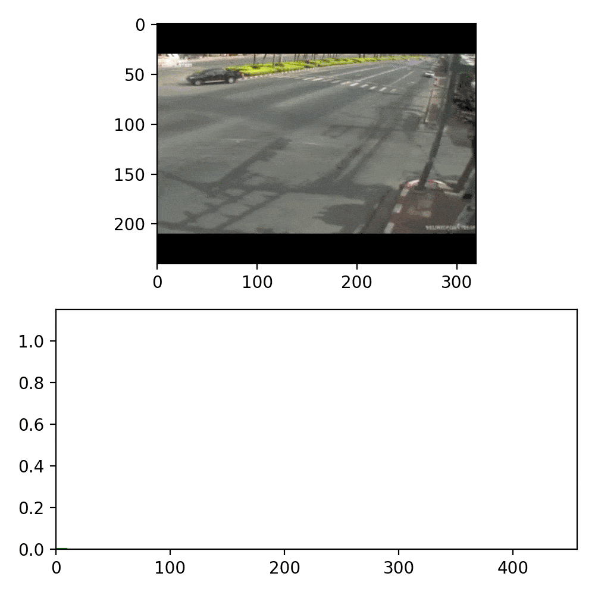
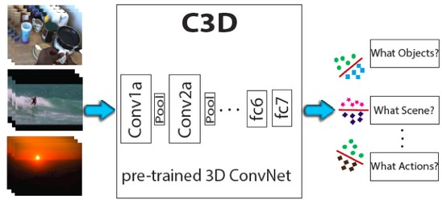

# Car Accident Detection Project
A vision-based traffic accident detection system in order to detect, record, and report traffic accidents automatically.

 *** If you like the Project, Give a star ***

## Results/Output
Resultant graph will shows abnormality in the graph when an accident occurs.

#### Example 1


#### Example 2


## Project Details
### Anomaly Detection:
Anomaly detection (aka outlier analysis) is a step in data mining that identifies data points,
events, and/or observations that deviate from a dataset's normal behavior. Anomalous data can
indicate critical incidents, such as a technical glitch, or potential opportunities, for instance a change
in consumer behavior.

### SpatioTemporal:
Spatial refers to space. Temporal refers to time. Spatiotemporal, or spatial temporal, is
used in data analysis when data is collected across both space and time. It describes a phenomenon
in a certain location and time — for example, shipping movements across a geographic area over
time (see above example image).

### C3D
((Reference: https://arxiv.org/pdf/1412.0767.pdf))

* It Means “Convolution 3D”
* C3D is obtained by training a deep 3D convolutional network on a large annotated video
dataset(UCF crime dataset).
* The dataset contains various concepts encompassing objects, actions, scenes and other
frequently occurring categories in videos.

    
* Compared with Recurrent Neural Networks (RNN) based methods, C3D outperforms Long-term
Recurrent Convolutional Networks (LRCN) and LSTM composite model by 14.1% and 9.4%,
respectively.

### C3D Architecture:


### C3D Feature Extraction:
To extract C3D feature, a video is split into 16 frame long clips with a 8-frame overlap
between two consecutive clips. These clips are passed to the C3D network to extract fc6 activations.
These clip fc6 activations are averaged to form a 4096-dim video descriptor which is then followed
by an L2-normalization. We refer to this representation as C3D video descriptor/feature in all
experiments, unless weclearly specify the difference.

### C3D Performance:
Using C3D features and a simple linear SVM, we achieve state of the art performance on
scene classification (96.7% on YUPENN and 77.7% on Maryland), objet classification (15.3% on
egocentric object) and action similarity labeling (72.9% on ASLAN) problems in the video domain.
We also approach the current best performance on action classification (76.4% on UCF101) without
using optical flow.


### Folder Structure:
<hr>

#### 1. fe_c3d:
    - It has all the C3D related files those are
    
    c3d.py -> architecture build, processing of input video
    classifier.py -> classifier model build
    configuration.py -> Initialization file paths
    extract_feature.py -> it is the starting point for feature extraction
    parameters.py -> parameters initialization
    plot_controller.py -> classifier build, savitzky_golay build
    
#### 2. catalog: (Django App)
    - static -> all the static files (CSS JS)
    
    - templates -> html templates
    
    - Django files: admin.py, apps.py, forms.py, middleware.py, models.py, tasks.py, urls.py, views.py
    
#### 3. locallibrary: (Django Home/Project Directory)
    - settings.py -> all the settings related to the project
    - urls.py -> url paths and redirections
    - wsgi.py -> django generated files
#### 4. media:
    - features -> it contains .npy files(stored features)
    - output -> output files (Processed files)
    - video -> input -> for saving input videos
#### 5. staticfiles:
    it contains all the static files like images, css, fonts, js
#### 6. templates:
    Base html templates


## Execution of the project

1. Get sports1m model weight:
    -  Download file https://github.com/adamcasson/c3d/releases/download/v0.1/sports1M_weights_tf.h5, rename and save in 'c3d/trained_models/c3d_sports1m.h5'
    
2. Start Django web app:
   ```
   python manage.py makemigrations
   python manage.py migrate
   python manage.py collectstatic
   python manage.py runserver
   ```  
3. Open brower to `http://127.0.0.1:8000`.

## References

[1] W. Sultani, C. Chen, and M. Shah, “Real-world anomaly detection in surveillance videos,” in The IEEE Conference on
Computer Vision and Pattern Recognition (CVPR), Jun. 2018.

[2] D. Tran, L. Bourdev, R. Fergus, et al., “Learning spatiotemporal features with 3d convolutional networks,” in The IEEE
International Conference on Computer Vision (ICCV), Dec. 2015 .

   [realworld]: <https://arxiv.org/pdf/1801.04264.pdf>
   [c3d]: <https://arxiv.org/pdf/1412.0767.pdf>
   
[3] Research Paper: https://arxiv.org/pdf/1412.0767.pdf

[4] http://vlg.cs.dartmouth.edu/c3d/

[5] https://research.fb.com/blog/2014/12/c3d-generic-features-for-video-analysis/

[6] https://github.com/facebookarchive/C3D
